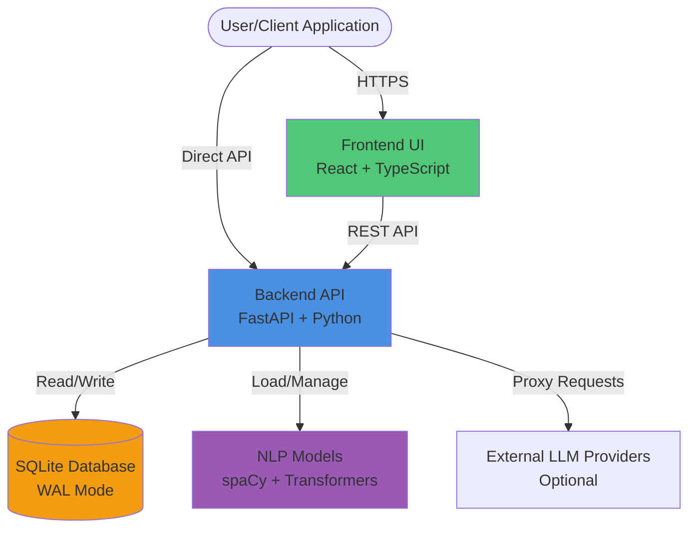
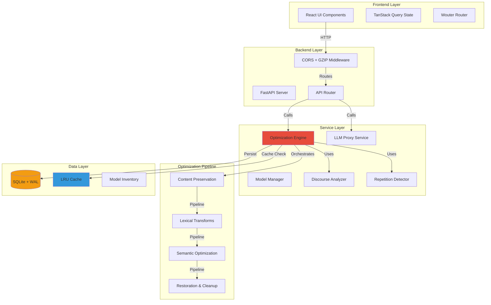
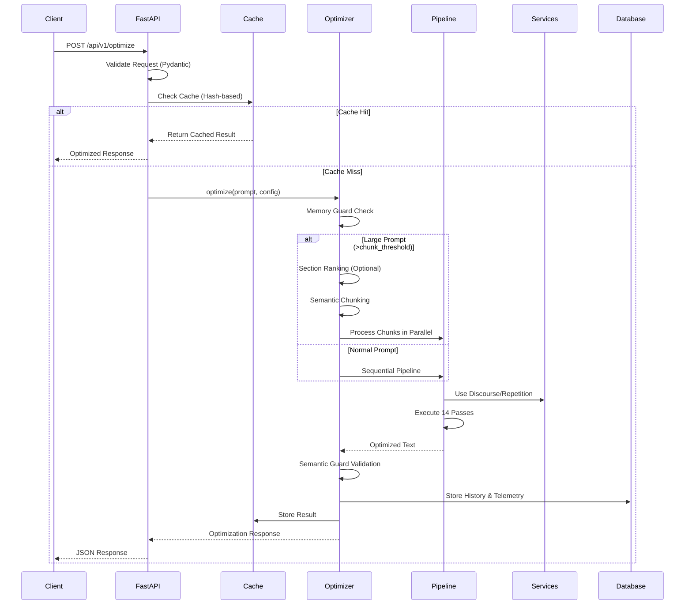
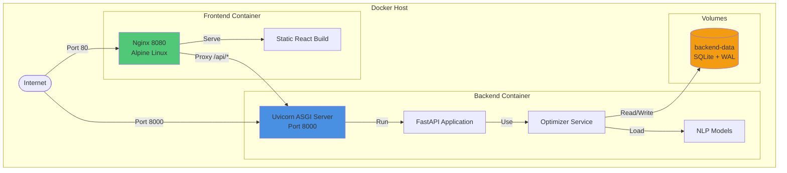

# Tokemizer: Architecture Documentation

## Table of Contents

1. [System Overview](#system-overview)
2. [Functional Architecture](#functional-architecture)
3. [Technical Architecture](#technical-architecture)
4. [Optimization Pipeline](#optimization-pipeline)
5. [Data Management](#data-management)
6. [Deployment Architecture](#deployment-architecture)
7. [Performance & Scaling](#performance--scaling)
8. [Security & Compliance](#security--compliance)
9. [Extension Points](#extension-points)

---

## System Overview

**Tokemizer** is an enterprise-grade prompt optimization engine that reduces LLM token consumption by up to 70% through deterministic, rule-based transformations. It employs a multi-pass pipeline with semantic safeguards to ensure quality preservation while maximizing compression.

### Design Principles

- **Predictability**: Rule-based transformations ensure explainable, reproducible results
- **Safety**: Semantic guards prevent optimizations that alter meaning
- **Efficiency**: Multi-threaded processing, LRU caching, and fast-path optimization minimize latency
- **Scalability**: Handles prompts exceeding 500K tokens through intelligent chunking
- **Model-Agnostic**: Works with any LLM provider (OpenAI, Anthropic, Google, etc.)

### Key Capabilities

- **Three Optimization Modes**: Conservative (30-35% savings), Balanced (40-45% savings), Maximum (50-70% savings)
- **Adaptive Multi-Pass Pipeline**: Mode-aware and profile-aware pass orchestration from preservation to finalization
- **Content Protection**: Automatic preservation of code blocks, URLs, numbers, citations
- **JSON Optimization**: TOON (Token-Oriented Object Notation) conversion for structured data
- **Semantic Validation**: Similarity scoring to ensure context preservation
- **Dynamic Model Management**: Runtime switching and management of NLP models via Admin UI
- **Section Ranking**: BM25, GZIP, and TF-IDF algorithms for large prompt filtering
- **Batch Processing**: Concurrent optimization for high-volume scenarios

---

## Functional Architecture

### System Context Diagram




### High-Level Component Architecture



### Use Cases

#### 1. Cost Optimization

Reduce LLM API costs by 50-70% through intelligent token compression without sacrificing output quality.

#### 2. Context Window Management

Fit more context into limited token windows by compressing prompts while preserving critical information.

#### 3. Performance Enhancement

Improve response times by reducing prompt size, leading to faster LLM inference.

#### 4. RAG Systems

Optimize retrieved documents before passing to LLM, maximizing context relevance within token limits.

#### 5. Batch Processing

Process large volumes of prompts efficiently with minimal resource overhead.

#### 6. Multi-Turn Conversations

Compress conversation history to maintain longer context windows without exceeding limits.

---

## Technical Architecture

### Technology Stack

#### Backend

- **Framework**: FastAPI 0.110.1
- **Language**: Python 3.11+
- **Web Server**: Uvicorn with async ASGI
- **Database**: SQLite with Write-Ahead Logging (WAL)
- **Tokenization**: tiktoken 0.8.0
- **NLP**: spaCy 3.7.2+ with optional coreference plugin support (pass auto-disables when unavailable)
- **Embeddings**: sentence-transformers 2.7.0+
- **ML Libraries**: scikit-learn 1.5.0, NumPy 1.26.0+
- **Deduplication**: datasketch 1.5.4+ (MinHash/LSH)
- **Serialization**: orjson 3.10.0+

#### Frontend

- **Framework**: React 19.2.0
- **Language**: TypeScript 5.6.3
- **Build Tool**: Vite 7.1.9
- **UI Library**: Radix UI
- **State Management**: TanStack Query 5.60.5
- **Styling**: Tailwind CSS 4.1.14
- **Routing**: Wouter 3.3.5

#### Deployment

- **Containerization**: Docker with multi-stage builds
- **Orchestration**: Docker Compose
- **Web Server**: Nginx (Alpine) for frontend
- **Base Images**: Debian Slim (backend), Alpine (frontend)

### API Endpoints

#### Core Optimization

- **POST** `/api/v1/optimize` - Single prompt optimization
- **POST** `/api/v1/batch` - Batch prompt optimization
- **POST** `/api/v1/optimize/stream` - Streaming optimization (chunked responses)

#### Canonical Mappings

- **GET** `/api/v1/canonical-mappings` - List all mappings
- **POST** `/api/v1/canonical-mappings` - Create single mapping
- **POST** `/api/v1/canonical-mappings/bulk` - Bulk create mappings
- **PUT** `/api/v1/canonical-mappings` - Update mapping
- **DELETE** `/api/v1/canonical-mappings` - Bulk delete mappings

#### History & Analytics

- **GET** `/api/v1/history` - Optimization history (paginated)
- **GET** `/api/v1/history/{id}` - Single optimization record
- **GET** `/api/v1/stats` - Aggregate statistics
- **GET** `/api/v1/telemetry` - Performance telemetry (paginated)

#### LLM Proxy

- **POST** `/api/v1/llm/test` - Test LLM provider connectivity
- **GET** `/api/v1/llm/providers` - List supported providers and models
- **GET** `/api/v1/llm/profiles` - Get LLM configuration profiles
- **PATCH** `/api/v1/llm/profiles` - Update LLM profiles

#### System

- **GET** `/api/v1/` - Root endpoint
- **GET** `/api/v1/health` - Health check with dependency status
- **GET** `/api/v1/docs` - Swagger UI documentation
- **GET** `/api/v1/redoc` - ReDoc documentation

#### Admin Management

- **GET** `/api/admin/models` - List managed models and status
- **POST** `/api/admin/models` - Add new model configuration
- **PUT** `/api/admin/models/{model_type}` - Update model configuration
- **DELETE** `/api/admin/models/{model_type}` - Remove model configuration

### Request/Response Flow



### Service Modules

### 1. Core Optimization Engine (`backend/services/optimizer`)

The heart of the system is a deterministic, multi-pass pipeline that processes text through 18 distinct stages:

1. **Protection**: Extracts and preserves code blocks, JSON, URLs, numbers, and quotes to prevent corruption.
2. **Structural Compression**: Removes boilerplate, normalizes whitespace, and compresses list structures.
3. **Lexical Analysis**: Applies linguistic transformations (synonyms, contractions, canonicalization) and removes noise.
4. **Semantic Compression**:
   * **Smart Router**: Classifies content (Code, JSON, Prose, Chat) to apply specialized optimization profiles.
   * **Entity Canonicalization**: Unifies varied references to the same entity.
   * **Coreference Resolution**: Replaces repeated entity mentions with pronouns or aliases.
5. **Advanced Reductions**:
   * **TOON Conversion**: Converts JSON to Token-Oriented Object Notation (Maximum mode).
   * **Frequency Learning**: Learns and abbreviates frequent domain-specific phrases.
   * **Entropy Pruning**: Removes low-information segments (Maximum mode).

### 2. API Server (`backend/main.py`)

**Responsibilities:**

- Proxy requests to external LLM providers
- Provider abstraction layer
- Error handling and retries
- Model listing and validation

**Supported Providers:**

- OpenAI
- Anthropic
- Google (Gemini)
- Groq
- Custom providers

#### 3. Discourse Analyzer (`services/discourse.py`)

**Responsibilities:**

- Analyze text structure and coherence
- Identify discourse markers
- Weight segments by importance
- Support semantic chunking

#### 4. Repetition Detector (`services/repetition.py`)

**Responsibilities:**

- Detect repeated phrases and fragments
- MinHash-based similarity detection
- Deduplication logic

### Data Models

#### OptimizationRequest

```python
{
    "prompt": str,                           # Required
    "optimization_mode": str,                # conservative|balanced|maximum
    "custom_canonical_map": Dict[str, str], # Optional custom mappings
    "enable_frequency_learning": bool,       # Adaptive abbreviations
    "force_preserve_patterns": List[str],    # Regex patterns to preserve
    "section_ranking": {                     # Optional pre-filtering
        "mode": str,                         # off|bm25|gzip|tfidf
        "token_budget": int                  # Target tokens after ranking
    },
    "json_compression": {                    # JSON handling config
        "default": bool,
        "overrides": Dict[str, bool]
    },
    "chunking_mode": str,                    # fixed|semantic|structured
    "use_discourse_weighting": bool          # Weight chunks by importance
}
```

#### OptimizationResponse

```python
{
    "optimized_output": str,
    "stats": {
        "original_tokens": int,
        "optimized_tokens": int,
        "token_savings": int,
        "compression_percentage": float,
        "processing_time_ms": float,
        "semantic_similarity": float,
        "embedding_reuse_count": int,
        "embedding_calls_saved": int,
        "embedding_wall_clock_savings_ms": float
    },
    "optimization_mode": str,
    "techniques_applied": List[str],
    "warnings": List[str]  # Optional validation warnings
}
```

---

## Optimization Pipeline

### Pipeline Architecture

Each request now initializes a shared semantic planning layer before ranking/chunking. The plan precomputes prompt `sections`, `paragraphs`, and `sentences` once and carries a request-scoped embedding vector cache so semantic ranking/chunking/query-aware compression can reuse overlapping embeddings without repeated encode calls.

The optimization pipeline consists of **14 sequential passes** organized into four categories:


**Legend:**

- `*` = Disabled in Conservative and/or Balanced modes
- `†` = Requires `enable_frequency_learning=true`

### Optimization Modes

| Mode             | Active Passes             | Disabled Passes                                                                                  | TOON | Speed       | Token Savings |
| ---------------- | ------------------------- | ------------------------------------------------------------------------------------------------ | ---- | ----------- | ------------- |
| **Conservative** | Reduced adaptive pass set | Coreference/example/history/entropy + additional expensive lexical passes are disabled by preset | ❌    | ~70% faster | 30-35%        |
| **Balanced**     | Default adaptive pass set | Example/history and a small subset of aggressive lexical passes disabled by preset               | ❌    | ~40% faster | 40-45%        |
| **Maximum**      | Full adaptive pass set    | No mode-level pass disables; runtime guards may still skip passes by profile/readiness           | ✅    | Baseline    | 50-70%        |

### Pipeline Pass Details

#### Category A: Protection & Preparation

- **Pass 1: Preserve Elements**: Extracts and protects code blocks, JSON, URLs, citations, and custom regex patterns

#### Category B: Lexical & Structural Compression

- **Pass 2: Compress Boilerplate**: Removes standard templates and repetitive noise
- **Pass 3: Whitespace Normalization**: Collapses multi-line breaks and redundant spaces
- **Pass 4: Lexical Transforms**: Power-pass with 8 sub-operations:
  - Instruction simplification
  - Unit normalization
  - Synonym shortening
  - Entity canonicalization
  - Politeness removal
  - Filler word removal
  - Number formatting
  - Redundancy removal
- **Pass 7: Fragment Compression**: Identifies and shortens long repeated text fragments
- **Pass 9: List Compression**: Optimizes list structures and formatting

#### Category C: Semantic & Advanced

- **Pass 5: Adaptive Abbreviation Learning** (Optional): Dynamically learns abbreviations from text frequency
- **Pass 6: Coreference Resolution**: Optional pronoun/reference compression when a compatible coreference plugin is installed; auto-skipped otherwise
- **Pass 8: Deduplication**: Semantic deduplication using LSH/MinHash to remove near-duplicate sentences
- **Pass 10: Example Compression** (Maximum only): Reduces verbose examples
- **Pass 11: History Summarization** (Maximum only): Condenses conversation history
- **Pass 12: Entropy Pruning** (Maximum only): Removes low-information content based on entropy scoring

#### Category D: Finalization

- **Pass 13: Normalization**: Final cleanup of punctuation and formatting
- **Pass 14: Content Restoration**: Reinserts protected elements from Pass 1 into the optimized buffer
- **Pass 15: TOON Conversion** (Maximum only): Converts JSON to Token-Oriented Object Notation for structured data compression

### Fast Path Optimization

For prompts under 400 tokens, a fast path is used:

1. Skip chunking and section ranking
2. Execute only essential passes
3. Minimal semantic validation overhead
4. Target latency: <100ms

Fast-path execution is restricted to single-line prompts; multi-line prompts always use the full pipeline.

### TOON (Token-Oriented Object Notation)

TOON is a compact encoding format for structured JSON data, enabled in Maximum mode:

**Features:**

- Tabular arrays with single field list and compact rows
- Explicit lengths and delimiter scoping
- Minimal quoting (only when required)
- Deterministic output with key order preservation
- Optional key folding for nested structures

**Example:**

```json
// Original JSON (45 tokens)
{
  "user": {
    "name": "John Doe",
    "email": "john@example.com",
    "age": 30
  }
}

// TOON (20 tokens, 55% reduction)
user
  name: John Doe
  email: john@example.com
  age: 30
```

---

## Data Management

### Database Schema

#### Tables

**1. optimization_history**

```sql
CREATE TABLE optimization_history (
    id INTEGER PRIMARY KEY AUTOINCREMENT,
    timestamp TIMESTAMP DEFAULT CURRENT_TIMESTAMP,
    original_tokens INTEGER,
    optimized_tokens INTEGER,
    token_savings INTEGER,
    compression_percentage REAL,
    processing_time_ms REAL,
    semantic_similarity REAL,
    optimization_mode TEXT,
    techniques_applied TEXT,  -- JSON array
    prompt_hash TEXT,
    cost_savings REAL
);
```

**2. canonical_mappings**

```sql
CREATE TABLE canonical_mappings (
    id INTEGER PRIMARY KEY AUTOINCREMENT,
    verbose_term TEXT UNIQUE NOT NULL,
    canonical_term TEXT NOT NULL,
    context TEXT,
    created_at TIMESTAMP DEFAULT CURRENT_TIMESTAMP,
    updated_at TIMESTAMP DEFAULT CURRENT_TIMESTAMP
);
```

**3. telemetry**

```sql
CREATE TABLE telemetry (
    id INTEGER PRIMARY KEY AUTOINCREMENT,
    timestamp TIMESTAMP DEFAULT CURRENT_TIMESTAMP,
    operation TEXT,
    duration_ms REAL,
    metadata TEXT,  -- JSON
    optimization_id INTEGER,
    FOREIGN KEY (optimization_id) REFERENCES optimization_history(id)
);
```

**4. batch_jobs**

```sql
CREATE TABLE batch_jobs (
    id INTEGER PRIMARY KEY AUTOINCREMENT,
    created_at TIMESTAMP DEFAULT CURRENT_TIMESTAMP,
    updated_at TIMESTAMP DEFAULT CURRENT_TIMESTAMP,
    status TEXT,  -- pending|processing|completed|failed
    total_prompts INTEGER,
    processed_prompts INTEGER,
    metadata TEXT  -- JSON
);
```

**5. llm_profiles**

```sql
CREATE TABLE llm_profiles (
    id INTEGER PRIMARY KEY AUTOINCREMENT,
    provider TEXT NOT NULL,
    model TEXT NOT NULL,
    config TEXT,  -- JSON with API keys, endpoints, etc.
    created_at TIMESTAMP DEFAULT CURRENT_TIMESTAMP,
    updated_at TIMESTAMP DEFAULT CURRENT_TIMESTAMP
);
```

### Write-Ahead Logging (WAL)

SQLite WAL mode is enabled for:

- Concurrent read access during writes
- Improved performance for high-concurrency scenarios
- Crash recovery and durability

**Configuration:**

```python
PRAGMA journal_mode=WAL;
PRAGMA synchronous=NORMAL;
PRAGMA cache_size=10000;
PRAGMA temp_store=MEMORY;
```

### Data Retention

- **History**: Indefinite by default (configurable retention policy)
- **Telemetry**: 90 days default (configurable)
- **Batch Jobs**: 30 days default (configurable)
- **LRU Cache**: In-memory, TTL-based (5 minutes default)

### Backup Strategy

**Recommended Approach:**

```bash
# Hot backup with WAL
sqlite3 app.db ".backup app_backup.db"

# Or use filesystem snapshot
docker run --rm -v tokemizer-data:/data -v $(pwd):/backup \
  alpine tar czf /backup/tokemizer-backup.tar.gz /data
```

---

## Deployment Architecture

### Docker Compose Topology



### Container Specifications

#### Backend Container

- **Base Image**: `python:3.11-slim`
- **Exposed Ports**: 8000
- **Memory**: 8-12GB (configurable via `BACKEND_MEMORY_LIMIT`)
- **CPU**: 1-2 cores (configurable via `BACKEND_CPU_LIMIT`)
- **Health Check**: `curl -f http://localhost:8000/api/v1/health`
- **Restart Policy**: `unless-stopped`

#### Frontend Container

- **Base Image**: `nginx:alpine`
- **Exposed Ports**: 8080 (mapped to host 80)
- **Memory**: 64-128MB
- **CPU**: 0.25-0.5 cores
- **Health Check**: `wget --spider http://localhost:8080/`
- **Restart Policy**: `unless-stopped`

### Environment Variables

Key configuration options (see [ENV_VARIABLES.md](ENV_VARIABLES.md) for complete list):

```bash
# Server
PORT=8000
UVICORN_WORKERS=1
CORS_ORIGINS=*

# Database
DB_PATH=/app/data/app.db
DB_POOL_SIZE=10

# Optimization
OPTIMIZER_CACHE_SIZE=256
OPTIMIZER_PREWARM_MODELS=true
PROMPT_OPTIMIZER_SEMANTIC_SIMILARITY=0.92
PROMPT_OPTIMIZER_CHUNK_SIZE=50000
PROMPT_OPTIMIZER_MAX_CHUNK_WORKERS=4

# Models
PROMPT_OPTIMIZER_SEMANTIC_GUARD_MODEL=BAAI/bge-small-en-v1.5
```

### Scaling Considerations

#### Horizontal Scaling

- Deploy multiple backend replicas behind a load balancer
- Use shared database (consider PostgreSQL for production)
- Implement distributed caching (Redis)

#### Vertical Scaling

- Increase memory allocation for large prompt processing (100K+ tokens)
- Add CPU cores for parallel chunk processing
- Use NVMe storage for faster database I/O

#### Resource Requirements by Workload

| Workload                     | Memory | CPU      | Storage | Notes                           |
| ---------------------------- | ------ | -------- | ------- | ------------------------------- |
| **Light** (<100 req/min)     | 4GB    | 1 core   | 10GB    | Small prompts (<10K tokens)     |
| **Medium** (100-500 req/min) | 8GB    | 2 cores  | 50GB    | Mixed prompt sizes              |
| **Heavy** (>500 req/min)     | 16GB+  | 4+ cores | 100GB+  | Large prompts, high concurrency |

---

## Performance & Scaling

### Performance Characteristics

#### Latency by Prompt Size (Balanced Mode)

| Prompt Size    | Processing Time | Compression | Memory Usage |
| -------------- | --------------- | ----------- | ------------ |
| < 1K tokens    | < 100ms         | 30-40%      | < 50MB       |
| 1-10K tokens   | 200-500ms       | 40-50%      | 100-200MB    |
| 10-50K tokens  | 0.5-2s          | 45-60%      | 200-500MB    |
| 50-100K tokens | 2-5s            | 50-65%      | 500MB-1GB    |
| 100K+ tokens   | 5-15s           | 55-70%      | 1-2GB        |

#### Throughput Benchmarks

- **Single Instance**: ~100-200 requests/minute (mixed workload)
- **Batch Processing**: ~1000+ prompts/minute (depends on size)
- **Cache Hit Rate**: 60-80% for repeated patterns

### Memory Management

#### Memory Guard

- Activates for prompts >200,000 tokens
- Requires minimum 8GB available system RAM
- Prevents OOM errors during high-concurrency scenarios
- Rejects requests that would destabilize the host

#### Resource Monitoring

```python
# Check available memory
from services.optimizer.core import PromptOptimizer
optimizer = PromptOptimizer()
available_gb = optimizer._check_available_memory()
```

---

## Security & Compliance

### Security Features

#### 1. Input Validation

- Pydantic models for request validation
- Size limits on prompts (configurable)
- Sanitization of user inputs
- Protection against injection attacks

#### 2. Content Protection

- Automatic preservation of sensitive patterns
- Configurable regex-based protection
- Citation and reference preservation
- Code block integrity maintained

#### 3. Data Privacy

- No data persistence in default mode (optional history storage)
- Optional encryption for stored history
- Configurable data retention policies
- GDPR-compliant data handling

#### 4. API Security

- CORS configuration for origin restrictions
- Rate limiting (configurable)
- Health check endpoints for monitoring
- Error handling without information leakage

### Compliance Considerations

#### Data Residency

- All processing occurs locally (no external API calls except optional LLM proxy)
- SQLite database stored on local filesystem
- Configurable data retention and deletion policies

#### Audit Trail

- Complete optimization history tracking
- Telemetry for performance analysis
- Configurable logging levels
- Exportable audit logs

### Best Practices

1. **Environment Variables**: Use `.env` files for sensitive configuration
2. **Semantic Guard**: Enable for quality validation (enabled by default)
3. **Custom Preservation**: Configure patterns for sensitive content
4. **History Review**: Regularly review optimization history for data leakage
5. **API Gateway**: Deploy behind gateway with rate limiting and authentication
6. **TLS/SSL**: Always use HTTPS in production
7. **Database Backups**: Implement regular backup schedule
8. **Resource Limits**: Configure memory and CPU limits to prevent resource exhaustion

---

## Extension Points

### 1. Custom Optimization Passes

New techniques can be implemented and integrated into the pipeline:

```python
# backend/services/optimizer/custom_pass.py
def custom_optimization_pass(text: str, config: dict) -> str:
    """
    Custom optimization logic.

    Args:
        text: Input text to optimize
        config: Pass configuration

    Returns:
        Optimized text
    """
    # Implementation
    return optimized_text

# Register in core.py _optimize_pipeline
```

### 2. Custom Canonical Mappings

Enterprise users can seed domain-specific terminology:

```bash
POST /api/v1/canonical-mappings/bulk
{
  "mappings": [
    {"verbose_term": "service level agreement", "canonical_term": "SLA"},
    {"verbose_term": "customer relationship management", "canonical_term": "CRM"}
  ]
}
```

### 3. Custom Section Ranking

Implement custom ranking algorithms:

```python
# backend/services/optimizer/section_ranking.py
def custom_ranking_algorithm(sections: List[str], budget: int) -> List[str]:
    """Custom section ranking logic."""
    # Implementation
    return ranked_sections
```

### 4. Custom LLM Providers

Add new LLM providers to the proxy:

```python
# backend/services/llm_proxy.py
def call_custom_provider(prompt: str, config: dict) -> str:
    """Custom LLM provider integration."""
    # Implementation
    return response
```

### 5. Custom Preservation Patterns

Configure application-specific content protection:

```json
{
  "force_preserve_patterns": [
    "ACCOUNT-\\d{8}",
    "TICKET-[A-Z]{3}-\\d{6}",
    "\\$\\d+\\.\\d{2}"
  ]
}
```


## Appendix

### Related Documentation

- [Pipeline Passes](PIPELINE_PASSES.md) - Detailed pass-by-pass technical analysis
- [API Documentation](API_DOCUMENTATION.md) - Complete API reference
- [Environment Variables](ENV_VARIABLES.md) - Configuration reference
- [Deployment Guide](deployment.md) - Production deployment instructions
- [Performance Telemetry](PERFORMANCE_TELEMETRY.md) - Telemetry and monitoring

### Glossary

- **TOON**: Token-Oriented Object Notation, a compact JSON encoding format
- **LSH**: Locality-Sensitive Hashing, used for near-duplicate detection
- **MinHash**: Probabilistic data structure for similarity estimation
- **WAL**: Write-Ahead Logging, SQLite journaling mode
- **BM25**: Best Matching 25, a ranking algorithm for information retrieval
- **Semantic Guard**: Validation mechanism using sentence embeddings
- **Coreference**: Resolution of pronouns to their referents
- **Entropy Pruning**: Removal of low-information content based on statistical measures
