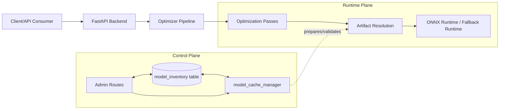
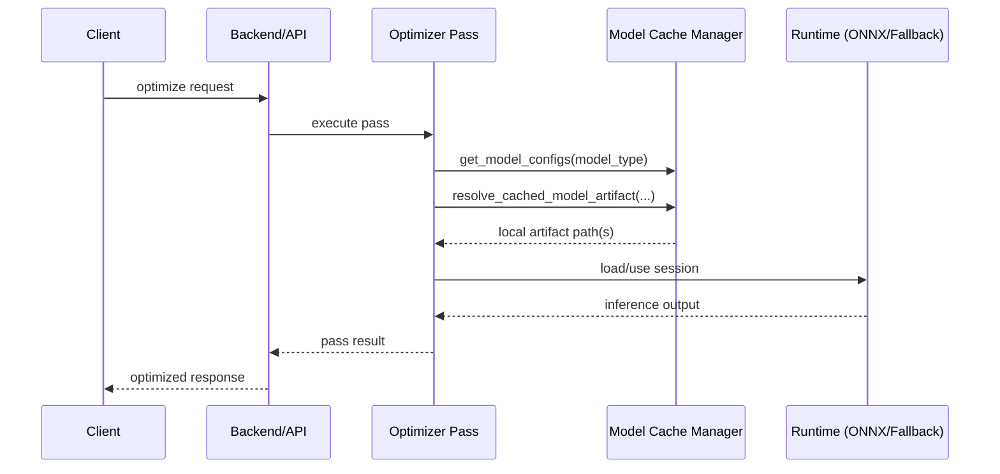
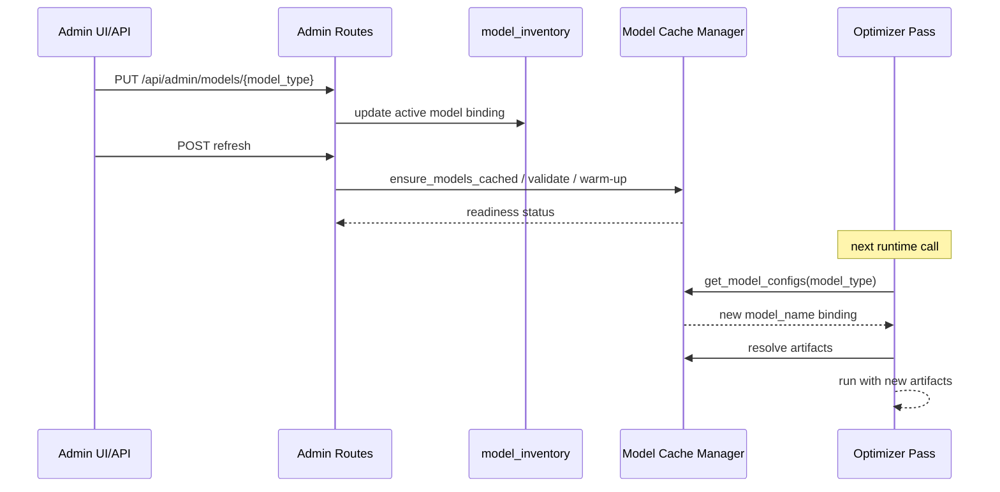

# Tokemizer Model Management Architecture

## Table of Contents

1. [Purpose and Scope](#purpose-and-scope)
2. [Executive Summary](#executive-summary)
3. [Design Principles](#design-principles)
4. [System Context](#system-context)
5. [Model Management Architecture](#model-management-architecture)
6. [Core Data Contracts](#core-data-contracts)
7. [Control Plane Capabilities](#control-plane-capabilities)
8. [Runtime Serving Path (How Inference Happens Today)](#runtime-serving-path-how-inference-happens-today)
9. [How Client Modules and Optimization Passes Use Managed Models](#how-client-modules-and-optimization-passes-use-managed-models)
10. [Dynamic Model Swap Without Client/Pass Breakage](#dynamic-model-swap-without-clientpass-breakage)
11. [Readiness, Mode Gating, and Failure Behavior](#readiness-mode-gating-and-failure-behavior)
12. [Operational Flows](#operational-flows)
13. [Sequence Diagrams](#sequence-diagrams)
14. [Module and Function Reference Map](#module-and-function-reference-map)
15. [Operational Best Practices](#operational-best-practices)
16. [Current Boundaries and Future Extension Path](#current-boundaries-and-future-extension-path)
17. [Quick FAQ](#quick-faq)

---

## Purpose and Scope

This document explains, in detail, how Tokemizer’s **current model management module** works end-to-end:

- what it owns,
- what it does not own,
- how models are selected, downloaded, validated, and resolved,
- how optimization passes consume managed models at runtime,
- how runtime model swaps happen without requiring pass-level code changes.

This document is intentionally focused on architecture and operations of model management and runtime consumption paths.

---

## Executive Summary

Tokemizer separates model concerns into two cooperating layers:

1. **Control Plane (Model Management)**
   - Source of truth: `model_inventory` rows.
   - Responsibilities: configuration, refresh, cache validation, artifact readiness checks, optional ONNX export orchestration.
2. **Runtime Plane (In-Process Inference)**
   - Lives inside optimizer/backend process.
   - Responsibilities: resolve currently active model by `model_type`, find local artifacts, initialize runtime sessions (ONNX or fallback), and execute pass-level inference.

This split is the core reason dynamic swaps work safely: optimization passes remain bound to **stable logical model slots** (`model_type`) while underlying repositories/artifacts are swappable.

---

## Design Principles

The current implementation follows these practical principles:

- **Stable logical contract:** passes depend on `model_type`, not hard-coded repository IDs.
- **Late binding at runtime:** active model names/artifacts are resolved from inventory/cache when needed.
- **Operational safety:** strict readiness checks and mode gating prevent running critical paths on missing/invalid artifacts.
- **No required restart for swap:** inventory changes and refresh can apply at runtime.
- **Performance-aware loading:** prefer local cache and ONNX artifacts for lower runtime overhead where available.

---

## System Context

Conceptually:

- Control plane decides **what should run** and **whether it is ready**.
- Runtime plane executes **how it runs now** for each request.

---

## Model Management Architecture

### Planes and Responsibilities

#### A) Control Plane

Owned primarily by:

- `backend/services/model_cache_manager.py`
- `backend/database.py` + `backend/database_extensions.py`
- `backend/routers/admin_routes.py`
- startup/refresh orchestration in `backend/server.py`

Responsibilities:

- Inventory fetch (`get_model_configs`) keyed by `model_type`.
- Cache resolution (`resolve_cached_model_path`, `resolve_cached_model_artifact`).
- Cache validation / readiness checks.
- Download/recovery/refresh orchestration (`ensure_models_cached`).
- Auth-aware download handling and operational issue recording.
- Optional ONNX export orchestration when expected artifacts require it.

#### B) Runtime Plane

Owned by optimizer modules that consume models:

- `backend/services/optimizer/entropy.py`
- `backend/services/optimizer/token_classifier.py`
- `backend/services/optimizer/metrics.py`
- `backend/services/optimizer/core.py` (orchestration and feature gating)

Responsibilities:

- Resolve active config for each required `model_type`.
- Resolve artifact paths from cache manager.
- Initialize runtime sessions and execute inference in-process.
- Apply pass-level fallback/disable behavior when unavailable.

---

## Core Data Contracts

### 1) Logical Contract: `model_type`

`model_type` is the stable logical interface between passes and model management.

Examples: `semantic_guard`, `semantic_rank`, `entropy_fast`, `token_classifier`, `coreference`.

### 2) Physical Binding: `model_name`

`model_name` points to the currently active repo/artifact source (typically HF repo ID).

This is what gets swapped during runtime model replacement.

### 3) Artifact Contract

`expected_files`, `min_size_bytes`, revision/pattern fields define what “ready/valid” means.

Runtime path assumes validated local artifact presence before loading sessions.

---

## Control Plane Capabilities

### Inventory and Config Resolution

- Active entries are read from `model_inventory` and normalized into a dict by `model_type`.
- Invalid JSON metadata entries are guarded and logged.

### Cache and Artifact Resolution

- The manager finds model root paths and individual files (`model.onnx`, `model.int8.onnx`, tokenizer/config files, etc.).
- Resolution supports nested/snapshot structures and file pattern matching.

### Download / Refresh / Recovery

- Control plane supports cache preparation and refresh modes from admin/startup flows.
- Refresh can be targeted or global depending on operation.

### ONNX Artifact Preparation

- When expected files imply ONNX usage and ONNX artifact is missing, manager can invoke ONNX export helper path.

### Auth/Error Guarding

- Repeated auth failures are tracked with guardrails to prevent wasteful repeated attempts.
- Download issue metadata is retained for operator diagnostics.

---

## Runtime Serving Path (How Inference Happens Today)

Today serving is **in-process inference** inside the backend optimizer process.

### Runtime steps (high-level)

1. Request enters optimizer pipeline.
2. Pass (or helper) resolves active model config via `get_model_configs()`.
3. Runtime resolves local artifact paths via cache manager helpers.
4. Pass initializes/uses ONNX session (preferred where configured), or fallback runtime path where implemented.
5. Inference outputs are consumed by pass logic and pipeline continues.

### Important implication

Tokemizer does not require an external inference server for these internal NLP pass models in current architecture; model management and runtime execution are coordinated but distinct.

---

## How Client Modules and Optimization Passes Use Managed Models

### Client/Pass Decoupling Pattern

Passes and modules **do not** bind to specific repository IDs in their core contract; they bind to logical use-cases (`model_type`).

This gives:

- stable call sites,
- swappable backing models,
- minimal/no pass code change during approved model replacement.

### Typical consumption pattern

1. Determine required logical slot (`model_type`) for the function.
2. Read active inventory mapping.
3. Resolve local artifact(s).
4. Instantiate runtime session.
5. Execute model-specific inference.

### Concrete pass examples

- Entropy paths use inventory + artifact resolution and attempt ONNX/fallback runtime initialization.
- Token classifier path follows the same contract and resolution pattern.
- Semantic metrics/warm-up helpers rely on same artifact resolution abstractions.

This shared pattern is the consistency layer across optimization modules.

---

## Dynamic Model Swap Without Client/Pass Breakage

Dynamic swap works because of indirection:

- **Stable key remains unchanged:** `model_type` stays constant.
- **Only binding changes:** `model_name` and prepared artifacts can change.
- **Runtime keeps using same lookup contract:** pass asks for `model_type`, receives whichever model is currently active and ready.

### Swap lifecycle (conceptual)

1. Admin updates model entry for a `model_type`.
2. Refresh/download/validation prepares artifacts.
3. Warm-up/readiness checks update status.
4. Subsequent runtime lookups resolve to the new active binding.

No pass API changes are required because pass contract never changed.

---

## Readiness, Mode Gating, and Failure Behavior

Model readiness is enforced by strict required-backend policy per optimization mode.

- If required model(s) are not ready, strict requests can fail rather than silently degrading critical guarantees.
- Some optional paths have explicit fallback behavior where implemented.

This is essential for safe dynamic swaps: new inventory bindings do not become effectively usable until cache/readiness state is valid.

---

## Operational Flows

### A) Startup Prewarm/Preparation

- Backend startup path can trigger model cache checks/preparation.
- Snapshot/readiness information is refreshed for operations visibility.

### B) Admin-Initiated Refresh

- Global or targeted refresh modes can be triggered from admin APIs.
- Refresh outcomes are reported through admin endpoints/status.

### C) Runtime Request Path

- Request-time pass execution reads current effective model mapping and local artifacts.
- Runtime may load/reuse session objects depending on pass module behavior.

---

## Sequence Diagrams

### 1) Runtime Inference Request

### 2) Dynamic Model Swap

---

## Module and Function Reference Map

### Control Plane

- **Model cache manager**
  - `get_model_configs`
  - `resolve_cached_model_path`
  - `resolve_cached_model_artifact`
  - `ensure_models_cached`
- **Admin/API integration**
  - model inventory CRUD + refresh endpoints
- **Server lifecycle**
  - startup/background cache prep + snapshot refresh hooks

### Runtime Plane

- **Core optimizer orchestration**
  - mode gating and inventory awareness
- **Entropy/token-classifier/semantic helpers**
  - runtime path initialization with ONNX-first and fallback behavior per module

---

## Operational Best Practices

1. Treat `model_type` as a stable API contract.
2. Validate `expected_files` realistically for the target runtime path.
3. Use targeted refresh for controlled rollout; use global refresh when baseline drift is expected.
4. Monitor readiness before enabling strict workloads after swap.
5. Keep old cache artifacts until replacement is stable, then clean with maintenance runbooks.
6. For private/gated repos, ensure valid HF token before refresh.

---

## Current Boundaries and Future Extension Path

Current boundary:

- Control plane is internal and runtime inference is in-process.

Possible extension path:

- Keep current control-plane contracts (`model_type` indirection, inventory, readiness),
- Add pluggable runtime backends (e.g., external serving) per model_type where justified,
- Maintain pass-facing contract unchanged.

This enables scale evolution without rewriting optimization passes.

---

## Quick FAQ

### Q1) Is model management the same as model serving?
No. In Tokemizer today, model management is the control plane; serving/inference occurs in-process in runtime modules.

### Q2) Why don’t swaps break pass code?
Because passes depend on stable logical slots (`model_type`) and resolve the active binding dynamically.

### Q3) Does swap require backend restart?
No. Runtime swap is supported through inventory update + refresh/warm-up flow.

### Q4) Can strict requests fail during swap?
Yes, if required artifacts are not ready yet; readiness/mode gating enforces this by design.
