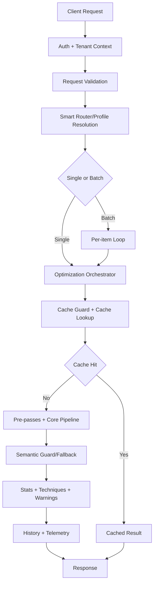

# Tokemizer: Product Requirements Document (PRD)

## 1. Executive Summary

Tokemizer is a production-grade prompt optimization platform that reduces token usage while preserving prompt meaning, context, and intent. It is designed for LLM applications that need lower inference cost, better context-window utilization, and predictable optimization quality.

The product is implemented as a FastAPI-based API service with tenant-aware authentication, customer-scoped data, request-level controls, model-readiness-aware degradation, and observability-first responses.

In addition to optimization quality, Tokemizer now operates as a SaaS control plane with subscription-aware access, quota governance, API key lifecycle management, and admin operational tooling.

**Core product promise:** maximize compression gains without breaking semantic fidelity.

---

## 2. Problem Statement

LLM teams repeatedly face the same constraints:

1. **Token spend growth** due to verbose instructions, repeated context, and boilerplate.
2. **Context window saturation** in RAG, long conversations, and enterprise workflows.
3. **Latency and throughput inefficiency** when prompts are inflated.
4. **Manual truncation risk** that drops critical details and hurts answer quality.
5. **Operational inconsistency** when optimization behavior is opaque or non-deterministic.
6. **SaaS governance overhead** for managing users, quotas, billing, API credentials, and tenant operations.

Tokemizer addresses these constraints through deterministic multi-pass optimization, profile-aware routing, safety guardrails, and production-ready SaaS operations.

---

## 3. Product Objectives

### 3.1 Primary Objectives

1. Reduce prompt tokens across common content types (prose, dialogue, markdown, technical docs, JSON-heavy payloads).
2. Preserve intent via semantic guardrails and conservative fallbacks.
3. Provide predictable control through `optimization_mode` (`conservative`, `balanced`, `maximum`).
4. Support both single-prompt and synchronous batch requests.
5. Offer clear, production-ready diagnostics through stats, techniques, warnings, routing metadata, and history.

### 3.2 Secondary Objectives

1. Keep integration simple for app teams (single endpoint, structured request/response).
2. Enable customer customization with canonical mappings and per-request canonicals.
3. Maintain strong operability via telemetry, cache, quota management, and admin controls.
4. Support subscription-aware self-serve and enterprise commercial flows.

### 3.3 Non-Goals (Current Scope)

1. No external LLM calls inside optimization passes.
2. No stochastic/generative rewrite engine for compression.
3. No mode that bypasses semantic safety controls in production pathways.

---

## 4. Target Users and Use Cases

### 4.1 User Personas

- **Application developers**: optimize prompts before provider calls.
- **Platform engineers**: enforce spend and latency goals.
- **AI product teams**: improve prompt quality at scale without refactoring every prompt manually.
- **Operations/admin teams**: manage customer settings, mappings, usage, billing-linked controls, and model readiness.

### 4.2 Primary Use Cases

1. **Interactive chat and assistants**: low-latency compression with high fidelity.
2. **Batch prompt processing**: maximize savings on large offline jobs.
3. **Query-aware RAG optimization**: prioritize relevance to user query.
4. **Enterprise terminology control**: tenant-level and request-level canonicalization.
5. **Long-context optimization**: chunked optimization for oversized prompts.
6. **SaaS operations**: identity, API keys, usage governance, and billing lifecycle management.

---

## 5. Scope and Functional Requirements

## 5.1 API Contract Requirements

1. Provide `POST /api/v1/optimize` as primary optimization endpoint.
2. Accept **either** `prompt` or `prompts` in each request (mutually exclusive).
3. Accept `optimization_mode` with default `balanced`.
4. Support request controls:
   - `segment_spans` (importance weighting/preservation)
   - `query` (query-aware optimization)
   - `custom_canonicals` (request-specific canonical map)
   - `name` (batch label for operator dashboards and traces)
5. Return response fields:
   - `optimized_output`
   - `stats`
   - `router` metadata where available
   - `techniques_applied`
   - `warnings`

## 5.2 Smart Selection and Routing Requirements

The system must implement **smart selection of passes**, not a rigid one-size-fits-all pipeline.

1. Detect or resolve `content_type` and `content_profile` before optimization.
2. Resolve smart context that influences pass behavior (e.g., chunking strategy, profile-aware toggles).
3. Merge pass decisions from:
   - optimization mode presets,
   - content profile restrictions,
   - request-level forced disabled passes,
   - runtime heuristics.
4. Ensure profile-sensitive skipping for high-risk contexts (e.g., code/json-sensitive passes).
5. Emit profile/routing context in output metadata for explainability.

## 5.3 Optimization Pipeline Requirements

1. Use staged, sequential passes with placeholder/preservation safety.
2. Support early and optional pre-passes (mode/profile/heuristic driven).
3. Support adaptive disabling of expensive passes when benefit is unlikely.
4. Support mode-gated advanced passes in `maximum`.
5. Support semantic guard validation and fallback where configured.
6. Restore protected spans/placeholders before final output serialization.

## 5.4 Performance and Scalability Requirements

1. Support large prompts (including very large payloads) with chunk-aware execution.
2. Use request/result cache for repeat workloads with cache guard controls.
3. Keep per-request overhead transparent through timing and profile stats.
4. Support synchronous batch optimization with per-item processing and aggregate behavior.

## 5.5 Security, Tenancy, and Governance Requirements

1. Enforce JWT Bearer auth for protected business endpoints.
2. Maintain customer-scoped persistence for history and mappings.
3. Keep optimization deterministic and self-contained without external LLM dependencies.
4. Preserve auditability via warnings, techniques, and persisted optimization records.

## 5.6 SaaS API Surface Requirements (Implemented)

In addition to optimization endpoints, the product must expose and maintain these tenant-aware API groups:

1. **Authentication & Profile** (`/api/auth`)
   - register, login, token refresh, profile read/update,
   - authenticated plan discovery for registration and upgrade workflows.
2. **API Key Management** (`/api/v1/keys`)
   - list, create, revoke API keys,
   - enforce plan-level max key limits (including unlimited plan semantics where configured).
3. **Usage & Quota** (`/api/usage`)
   - current period usage,
   - quota remaining,
   - period history and source-level usage breakdown.
4. **Canonical Mapping Management** (`/api/v1/mappings`)
   - list/create/update/delete tenant mappings,
   - toggle and query disabled OOTB mappings.
5. **Billing & Subscription** (`/api/billing`, `/api/subscription`)
   - checkout session creation,
   - billing portal session creation,
   - plan upgrades with paid vs free/contact-sales handling.
6. **Billing Webhooks** (`/api/webhooks`)
   - subscription lifecycle synchronization from payment providers.

## 5.7 Admin Control Plane Requirements (Implemented)

Admin capabilities must support operational governance and runtime readiness:

1. **User administration**: list/create/update/deactivate users and inspect per-user usage.
2. **Plan administration**: create/list/delete plans, manage pricing semantics (`0`, `>0`, `-1`) and public visibility.
3. **Settings administration**: read/update runtime operational settings and validate email configuration.
4. **Model inventory administration**: list/manage model records, refresh cache globally/per-model, and validate air-gap readiness.
5. **Telemetry and model cache controls**: support refresh/version controls and readiness diagnostics for operational transparency.

---

## 6. Optimization Modes and Pass Policy

| Mode           | Intent                    | Pass Policy                                                                             |
| -------------- | ------------------------- | --------------------------------------------------------------------------------------- |
| `conservative` | fastest path              | Disables heavier/advanced passes and selected lexical transforms to prioritize latency. |
| `balanced`     | default production mode   | Enables most practical passes while keeping highest-cost advanced operations off.       |
| `maximum`      | highest savings potential | Enables advanced and optional pre-passes (subject to profile/model/runtime gates).      |

### 6.1 Mode-Driven Guarantees

1. Mode is a **policy input**, not a hardcoded pass count.
2. Actual pass execution depends on runtime conditions and profile safety.
3. Safe degradation is allowed (e.g., downgrade from requested mode when model readiness is insufficient).
4. Degradation must be visible to clients through warnings.

---

## 7. System Architecture



### 7.1 Architectural Components

1. **API layer**: validation, auth, response shaping.
2. **Orchestrator**: routing, mode resolution, pipeline execution, fallback handling.
3. **Router**: content classification, profile resolution, smart context selection.
4. **Pass engine**: staged transforms with profile/mode/heuristic controls.
5. **Persistence layer**: usage/history/mapping data.
6. **Operational layer**: cache, quota, telemetry, warnings.
7. **SaaS control plane**: auth, API keys, subscription/billing, admin settings, model operations.

---

## 8. Detailed Pipeline Architecture (Code-Aligned)

The optimizer executes an adaptive sequence. Passes are selectively enabled/disabled to maintain the best quality/speed tradeoff for each request.

### 8.1 Pre-Pipeline Stage

1. Resolve optimization mode config (disabled passes + pass toggles + TOON flag).
2. Resolve content profile and smart context from text or explicit profile information.
3. Build request-scoped planning context for semantic/section-aware operations.
4. Evaluate optional pre-passes under mode + policy checks:
   - normalized sentence dedup pre-pass,
   - section ranking pre-pass,
   - maximum pre-pass,
   - token-classifier pre-pass (gated by mode/conditions).
5. Decide chunking path for oversized prompts.

### 8.2 Core Pipeline Stage (Conceptual Order)

1. **Preserve elements**
   - placeholders/protected spans,
   - JSON handling policy,
   - optional JSON key aliasing in maximum mode.
2. **Reference aliasing** (when enabled and safe for profile/content).
3. **Boilerplate compression**.
4. **Whitespace normalization**.
5. **Structural compression group**:
   - field-label compression,
   - exact-line deduplication,
   - prefix/suffix factoring (enumerated and general forms).
6. **Lexical transform group**:
   - instruction-noise cleanup,
   - canonicalization (tenant + default + request custom map),
   - synonym shortening,
   - contractions,
   - number/unit normalization,
   - precision reduction,
   - clause and list compression,
   - optional symbolic replacements and article removal for low-weight segments.
7. **Linguistic quality passes**:
   - adjunct clause trimming (model availability dependent),
   - parenthetical compression to glossary-like structures.
8. **Constraint/repetition passes**:
   - constraint hoisting,
   - repeated-fragment compression.
9. **Coreference compression** (mode/profile/model dependent).
10. **Advanced passes (mostly maximum)**:
    - example compression,
    - history summarization,
    - low-entropy pruning.
11. **Restore preserved content**.
12. **Semantic guard checks and fallback/reversion logic**.
13. **Final normalization and response stat assembly**.

### 8.3 Dynamic Skip Logic Requirements

1. Pass execution must honor resolved disabled-pass set.
2. Additional runtime skip conditions must apply for profile-risk contexts.
3. Heuristics may disable expensive downstream passes when predicted gain is low.
4. Safety and semantic integrity take precedence over raw compression ratio.

---

## 9. Request and Response Schema Requirements

### 9.1 Endpoint

- `POST /api/v1/optimize`

### 9.2 Request Body (Current)

```typescript
{
  prompt?: string;
  prompts?: string[];
  name?: string;
  optimization_mode?: "conservative" | "balanced" | "maximum";
  segment_spans?: Array<{
    start: number;
    end: number;
    label?: string;
    weight?: number; // 0..1
  }>;
  query?: string;
  custom_canonicals?: Record<string, string>;
}
```

### 9.3 Response Body (Current)

```typescript
{
  optimized_output: string;
  stats: {
    original_chars: number;
    optimized_chars: number;
    compression_percentage: number;
    original_tokens: number;
    optimized_tokens: number;
    token_savings: number;
    processing_time_ms: number;
    fast_path: boolean;
    content_profile: string;
    smart_context_description: string;
    semantic_similarity?: number;
    semantic_similarity_source?: string;
    deduplication?: Record<string, number>;
    toon_conversions?: number;
    toon_bytes_saved?: number;
    embedding_reuse_count?: number;
    embedding_calls_saved?: number;
    embedding_wall_clock_savings_ms?: number;
    section_ranking_selected_sections?: number[];
    section_ranking_trigger?: string;
    maximum_prepass_selected_sentences?: number[];
    maximum_prepass_target_tokens?: number;
    maximum_prepass_policy_source?: string;
    maximum_prepass_policy_enabled?: boolean;
    maximum_prepass_policy_mode?: string;
    maximum_prepass_policy_enabled_override?: boolean;
    maximum_prepass_policy_minimum_tokens?: number;
    maximum_prepass_policy_budget_ratio?: number;
    maximum_prepass_policy_max_sentences?: number;
    profiling_ms?: Record<string, number>;
  };
  router?: {
    content_type: string;
    profile: string;
  };
  techniques_applied?: string[];
  warnings?: string[];
}
```

### 9.4 API Behavioral Requirements

1. Return clear warnings for degraded mode, missing model-readiness, or fallback use.
2. Preserve deterministic behavior for same input + same settings.
3. Include routing/context metadata to support operator analysis.

---

## 10. Data, Persistence, and Tenant Isolation

1. Optimization history is persisted with customer scoping.
2. Canonical mappings are customer-scoped and queryable/updateable through API surfaces.
3. Usage, quota, and related operational data must be tenant-safe.
4. API keys are stored as hashes and full key material is only returned on creation.
5. Caching must not break tenant boundaries.

---

## 11. Non-Functional Requirements

### 11.1 Reliability

1. Fail safe on unavailable optional model components.
2. Prefer graceful degradation over hard request failure when feasible.
3. Ensure warnings explain degraded behavior.

### 11.2 Performance

1. Maintain practical latency envelopes by mode and prompt size.
2. Optimize for repeated workloads via cache.
3. Keep heavy passes conditional to avoid unnecessary cost.

### 11.3 Maintainability

1. Preserve modular pass architecture with explicit pass names/toggles.
2. Keep pipeline behavior discoverable through docs and response telemetry.
3. Keep PRD and architecture documentation code-aligned.

---

## 12. Observability and Operational Requirements

1. Track processing time and compression metrics at response level.
2. Track pass and pre-pass outcomes via `techniques_applied` and specific stats fields.
3. Expose warning surfaces for fallback and model readiness issues.
4. Persist optimization events for trend and anomaly analysis.
5. Provide admin-level visibility into model cache readiness and refresh outcomes.
6. Support telemetry controls and diagnostics needed for incident response.

---

## 13. Security and Compliance Requirements

1. JWT-based authentication for protected endpoints.
2. Customer isolation for data access and persistence.
3. Role-based authorization for admin-only surfaces.
4. No external prompt exfiltration to third-party optimization models.
5. Structured operational logging and telemetry for incident review.

---

## 14. Risks and Mitigation Plan

1. **Risk:** Over-compression harms prompt intent in edge cases.
   **Mitigation:** semantic guard, fallback/reversion, segment weighting.

2. **Risk:** Advanced pass dependencies unavailable at runtime.
   **Mitigation:** mode validation, safe downgrade paths, explicit warning output.

3. **Risk:** Large prompt latency spikes.
   **Mitigation:** chunking path, cache usage, adaptive pass gating.

4. **Risk:** Operator confusion from adaptive behavior.
   **Mitigation:** detailed stats, router metadata, and warnings for transparency.

5. **Risk:** SaaS governance failures (quota, tenant boundaries, plan mismatches).
   **Mitigation:** strict customer scoping, quota checks, plan-aware enforcement, and admin auditability.


---

# 15. Future Enhancements

---

Future enhancements focus on operational reliability, enterprise adoption, and measurable customer value.

### 15.1 Near-Term

1. **Asynchronous Batch Processing**
   - Introduce queued batch jobs with status polling and optional callback webhook completion notifications.
2. **Usage Export and Cost Reporting**
   - Provide downloadable tenant usage exports (CSV/JSON) and savings trend reports.
3. **Quota Alerts and Soft-Limit Policies**
   - Add configurable warning thresholds and overage-safe controls for plan governance.
4. **Admin Audit Trail**
   - Persist immutable audit entries for admin actions across users, plans, settings, and model inventory changes.


### 15.2 Mid-Term

1. **Workspace/Organization Model**
   - Add multi-user organizations with scoped roles (`owner`, `admin`, `member`, `viewer`).
2. **Enterprise SSO (SAML/OIDC)**
   - Support enterprise identity federation and centralized access controls.
3. **Budget and Spend Alerting**
   - Add budget caps and proactive notifications tied to projected usage and plan limits.
4. **Regional Data Residency Options**
   - Introduce deployment/storage residency controls for regulated enterprise workloads.


### 15.3 Long-Term

1. **Enhanced Query-Aware Optimization**
   
   * Multi-query document ranking
   * Learned relevance models
   * Context-specific compression

2. **Domain-Specific Optimization**
   
   * Legal document compression templates
   * Code documentation optimization
   * Scientific paper summarization etc.

3. **Multi-Language Support**
   
   * Language-specific rules
   * Cross-language optimization
   * Translation-aware compression

4. **Streaming API**
   
   * Progressive optimization
   * Chunk-by-chunk processing
   * Real-time compression
